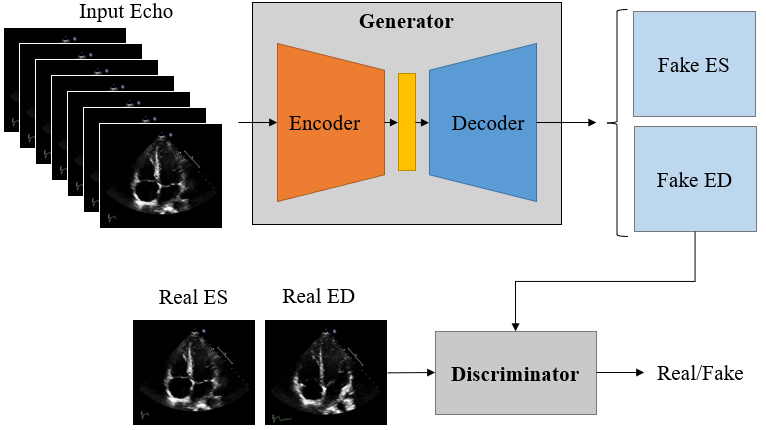

# Use of Generative Adversarial Networks to Improve Left Ventricular Ejection Fraction Estimation from Echocardiogram Cine Series

## Abstract
Left ventricular (LV) ejection fraction (EF) is a measurement indicating the amount
of blood pumped by the heart and is an important indicator of heart failure such as
imminent stroke. The clinical procedure quantifying this ratio involves identifying
end-systolic (ES) and end-diastolic (ED) frames in an echocardiogram (echo)
cine series, followed by tracing the LV on these frames. The frame selection
and tracing operations introduce independent errors, causing high inter-observer
variability in the estimated EF. Because of this, machine learning-based ejection
fraction estimation methods have gained popularity to act as secondary layers of
verification. Most such methods rely on an initial embedding obtained from input
echo cine series using convolutional neural networks. Therefore, these models
are limited by how well these embeddings encode the anatomical information of
the heart. In this project, we aim to improve automatic EF estimation models by
introducing a pre-training stage where generative adversarial networks (GAN) are
used to obtain higher-quality embeddings from echo. In the pre-training stage,
we train a GAN to produce ED and ES frames from an input echo video, which
encourages the intermediate embeddings to learn the anatomical information of
the heart while paying more attention to the ED/ES phases. The pre-trained
encoder is then used in a supervised learning setting to perform EF estimation.
We showcase the success of our proposed approach by showing a 5% R2 score
increase compared to baselines not using the aforementioned pre-training

  

## Dataset
EchoNet-Dynamic public EF dataset is used for this project. This dataset can be accessed
[here](https://echonet.github.io/dynamic/index.html).
Feel free to download the dataset in any convenient location and provide its directory in the config file as described 
in section [Config File](#config-file)

## Training
Run the following command to train the GAN model first (set "mode" to "generator" in the config):

`python3 run.py --config_path ./configs/default.yml --save_dir <path_to_save_model_artefacts>`

After the GAN is trained provide its checkpoint in the "checkpoint_path" and set "mode" to "ef" in the config file. Now 
run the following command to start training the model for EF estimation:

`python3 run.py --config_path ./configs/default.yml --save_dir <path_to_save_model_artefacts>`

## Testing
To test the model, use the same command as training but path the "--test" option.